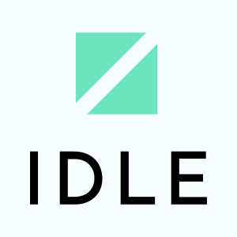

This is the main source code repository for Idle. It contains the compiler, standard library, and documentation.

## Why Idle?

* Focus on performance through ECS and DOD.
* Easy to learn, yet powerful to use.
* Supports integration with existing tools.
* Takes the hassle out of you and takes care of the details.

## :🚨: WARNING :🚨:

Idle is in the early stages of development. Important features are missing. Documentation is sparse. DO NOT USE until 1.0.0 release

## License

Idle source code is dual-licensed under either of:

* MIT License ([LICENSE-MIT](LICENSE-MIT) or [http://opensource.org/licenses/MIT](http://opensource.org/licenses/MIT))
* Apache License, Version 2.0 ([LICENSE-APACHE](LICENSE-APACHE)
  or [http://www.apache.org/licenses/LICENSE-2.0](http://www.apache.org/licenses/LICENSE-2.0))

at your option.
